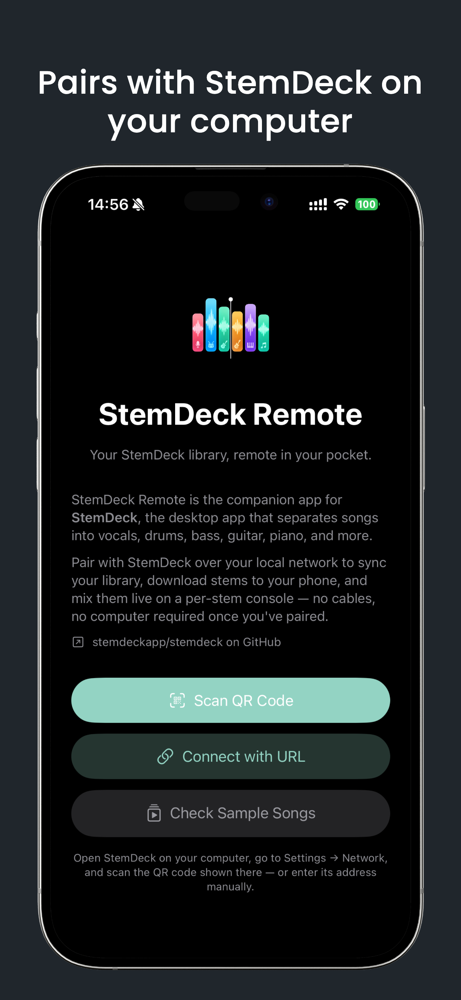
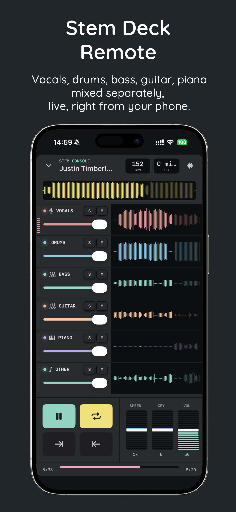
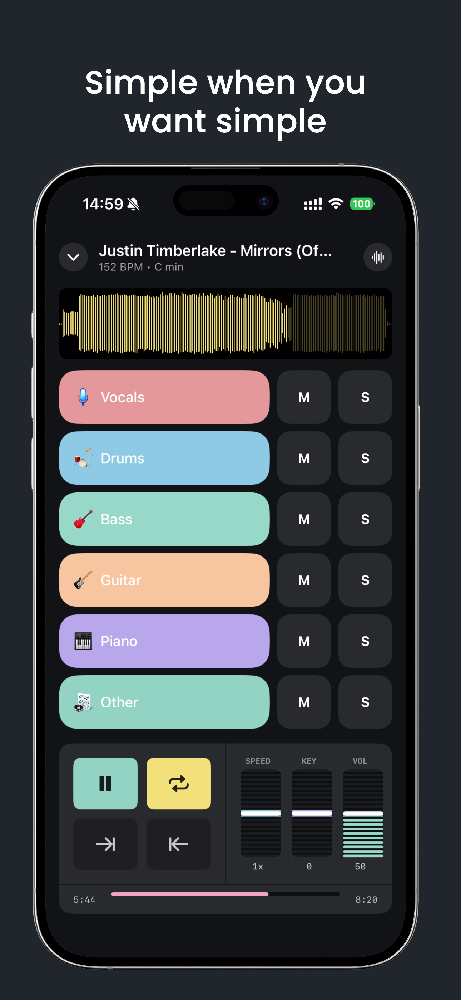
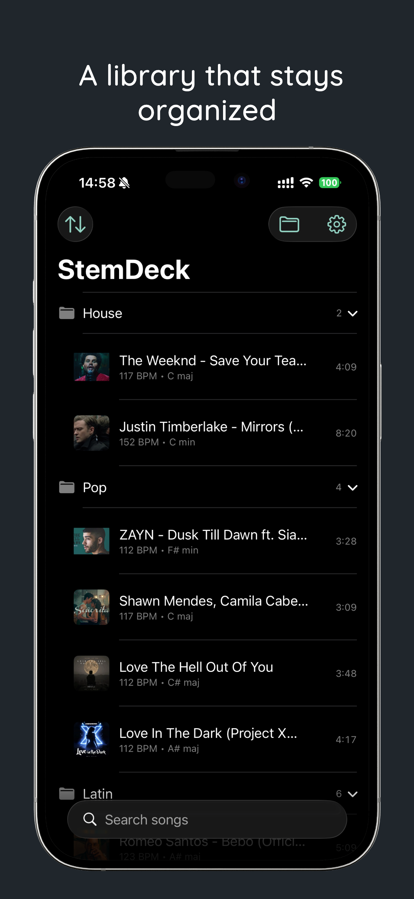

# StemDeck Remote

Native iOS and Android companion apps for
**[StemDeck](https://github.com/stemdeckapp/stemdeck)** — the desktop app
that separates songs into vocals, drums, bass, guitar, piano, and more. Pair
with a StemDeck instance on your local network to sync your song library,
download stems to your phone, and mix them live on a per-stem console — no
cables, no computer required once you've paired.

<table>
  <tr>
    <td align="center" width="25%">
       
      <b>Pairs with StemDeck on your computer</b> Scan a QR code or type its address
    </td>
    <td align="center" width="25%">
       
      <b>Split any song into its parts</b> Vocals, drums, bass, guitar, piano — mixed live
    </td>
    <td align="center" width="25%">
       
      <b>Simple when you want simple</b> One fader per part, one tap to mute or solo
    </td>
    <td align="center" width="25%">
       
      <b>A library that stays organized</b> Sort songs into folders on your phone
    </td>
  </tr>
</table>

## Get the app

  
  &nbsp;
  

- **iOS / iPadOS:** [StemDeck Remote on the App Store](https://apps.apple.com/us/app/stemdeck-remote/id6808981150)
- **Android:** [StemDeck Remote on Google Play](https://play.google.com/store/apps/details?id=com.stemdeck.remote)

Both apps also build from source — see [`ios/README.md`](ios/README.md) and
[`android/README.md`](android/README.md).

## Two native apps, one companion product

- **[`ios/`](ios/README.md)** — SwiftUI, `AVAudioEngine`
- **[`android/`](android/README.md)** — Jetpack Compose, Media3

They're independent native codebases with no shared code between them (each
reimplements its own networking/models/UI natively) — see
[`docs/ARCHITECTURE.md`](docs/ARCHITECTURE.md) for why, and for a detailed,
platform-by-platform breakdown of every design decision.

## Highlights

- QR or manual pairing over your local Wi-Fi network — no account, no cloud
  service, nothing StemDeck itself doesn't already serve
- Background stem downloads, so songs are usually already local by the time
  you tap them open
- Per-stem mixing: independent volume/mute/solo per stem, plus shared
  speed and pitch control across the whole mix
- Mark In / Mark Out region looping — a DAW-style A/B loop for practicing a
  specific section, right on the master waveform
- Two console layouts: a plain waveform-and-fader "Simple" view, and a full
  six-stem "Advanced" hardware-rack view with per-stem waveforms, LED level
  meters, and dB-precise faders
- Client-side folders and a local Trash for organizing your library —
  neither ever touches StemDeck itself; StemDeck's own library is
  unaffected either way
- Background playback with lock-screen / notification transport controls
- Three bundled, Creative Commons-licensed sample songs so the stem console
  can be tried without pairing to a live StemDeck instance at all

## Prerequisites

**To run StemDeck itself** (required for anything beyond the bundled sample
songs): a StemDeck desktop instance, with **Settings → Network → "Make
available on your network"** turned on. See
[stemdeckapp/stemdeck](https://github.com/stemdeckapp/stemdeck) for setup —
it runs on macOS, Windows, and Linux.

**To build the iOS app:**
- Xcode (current stable release)
- [XcodeGen](https://github.com/yonaskolb/XcodeGen) (`brew install xcodegen`) — the `.xcodeproj` is generated, not committed
- iOS 16.0+ deployment target (Simulator or a physical device)

**To build the Android app:**
- Android Studio (current stable release), or a JDK 17+ and the Android
  command-line tools
- Android SDK with `compileSdk 35` installed
- Android 8.0+ (API 26) device or emulator

Full build steps are in each platform's own README.

## Testing / compatibility

Both apps have been tested end-to-end against a StemDeck desktop instance
running on **macOS** — pairing (QR and manual), https with a self-signed LAN
certificate, plain http, library sync, background stem downloads, and full
mixer playback, on both the iOS and Android apps in this repo. StemDeck
itself also runs on Windows and Linux; since both clients only ever talk to
its plain REST API over the LAN, there's no reason to expect different
behavior there, but that combination specifically hasn't been verified yet —
if you try it, an issue report either way (works or doesn't) is welcome.

## Acknowledgments

StemDeck Remote exists because of **[StemDeck](https://github.com/stemdeckapp/stemdeck)**
— the free, local, open-source stem separation app this companion talks to.
Everything that actually makes stems lives there: Demucs-based 6-stem
separation, song analysis (BPM, key, loudness), the library, and the LAN
REST API both clients speak. This repo is only a remote control and mixer
for an instance you run yourself. If you're looking for the audio-separation
engine, that's the project you want.

Huge thanks to the StemDeck maintainers and community for building something
local-first, account-free, and openly licensed (Apache 2.0), and for exposing
a network API that made a phone and tablet companion possible at all. We're
grateful they made the desktop app open enough to build on.

If StemDeck Remote is useful to you, please star, follow, and support the
main project:

- GitHub: [stemdeckapp/stemdeck](https://github.com/stemdeckapp/stemdeck)
- Discord: [discord.gg/YhCKsjhcwB](https://discord.gg/YhCKsjhcwB)
- Reddit: [r/StemDeckApp](https://www.reddit.com/r/StemDeckApp/)
- Website: [stemdeck.app](https://stemdeck.app)

The six full-color stem icons (Vocals, Drums, Bass, Guitar, Piano, Other) are
from [iconpacks.net](https://www.iconpacks.net/), free for personal and
commercial use.

## Contributing

Issues and pull requests are welcome. There's no formal contribution
process yet beyond: keep changes to one platform's own idioms (see
`docs/ARCHITECTURE.md`), and if a change should exist on both platforms,
please include both in the same PR so they don't drift apart.

## Support

Found a bug or have a question? Please
[open an issue](https://github.com/udeysri/StemDeckRemote/issues) — this is
also the support URL listed for both apps in their store listings.

## License

Licensed under the [Apache License 2.0](LICENSE) — the same license
StemDeck itself uses.
